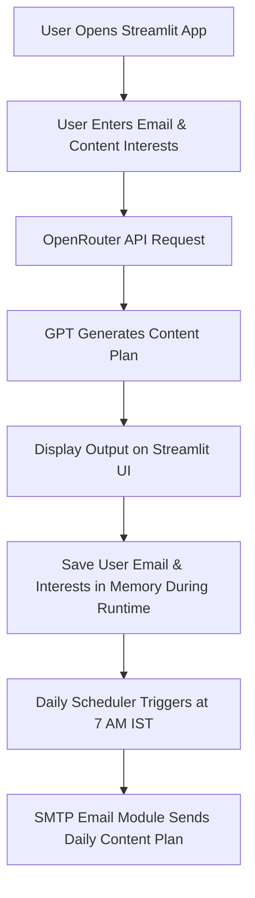

# Social Media Agent – AI Agent Development Challenge (48 Hours)

This project is built as part of the **AI Agent Development Challenge**.
It is a fully functional **Social Media Agent** that generates customized content plans, captions, ideas, and daily emails for users based on their interests.

---

## 🚀 Overview

The **Social Media Agent** helps creators, marketers, and businesses automate their social media strategy by:

* Gathering user interests
* Generating personalized content plans using GPT
* Emailing the daily content plan every morning at **7:00 AM IST**
* Allowing manual generation of plans through the Streamlit UI

The agent is designed for **Marketing & Support Automation**, following the official challenge guidelines.

---

## 🎯 Features

### ✅ Core Features

* **Streamlit-based Web UI**
* **User input collection** (email + content topics)
* **AI-powered content plan generation** (via OpenRouter GPT API)
* **Daily Automated Email Delivery** using SMTP
* **Manual “Generate Now” button for testing**
* **Scheduler logs and status indicators**

### 🔧 Additional Functionalities

* .env support for API keys and secrets to run locally.
* Clean modular code structure
* Currently works with any GPT model on OpenRouter
* Lightweight, deployable, and free-tier compatible

---

## 🧱 Tech Stack

|       Component        |         Technology Used            |
| ---------------------- | ---------------------------------- |
| Frontend UI            | **Streamlit**                      |
| AI Model               | **GPT Models via OpenRouter API**  |
| Environment Management | **python-dotenv**                  |
| Email Automation       | **SMTP (Gmail)**                   |
| Scheduler              | **apscheduler** Python package     |
| Deployment             | **Streamlit Cloud**                |
| Version Control        | **GitHub**                         |

---

## 📁 Project Structure

```
social-media-agent/
│
├── streamlit_app.py       # Main application
├── requirements.txt       # Dependencies
├── README.md              # Project documentation
└── .env (not included, include and add your API keys while you run locally)    # API keys and secrets
```

---

## 🔐 Environment Variables (.env)

Your project expects the following:

```
# OpenAI / OpenRouter
OPENAI_API_KEY = sk-xxxxxxxxxxxx
OPENAI_MODEL = OpenAI:gpt-oss-20b (curretly used, you change according to your api key)

#Setting up SMTP
SMTP_SERVER = smtp.gmail.com
SMTP_PORT = mention port number

# Email
SMTP_USERNAME= "your_email@gmail.com"
SMTP_PASSWORD= "your_16_char_app_password"
SENDER_EMAIL="your_email@gmail.com"

# Scheduling
DAILY_SEND_TIME=07:00

```

> ⚠️ Do not commit `.env` to GitHub.

---

## ▶️ How to Run Locally

### **1. Clone the repository**

```
git clone https://github.com/Vikas-Karthik-S/social-media-agent.git
cd social-media-agent
```

### **2. Create a virtual environment**

```
python -m venv venv
venv/Scripts/activate  (Windows)
source venv/bin/activate (Mac/Linux)
```

### **3. Install dependencies**

```
pip install -r requirements.txt
```

### **4. Add your `.env` file**

Create a `.env` file in the project root and add you keys and secrets.

### **5. Run the Streamlit app**

```
streamlit run streamlit_app.py
```

---

## 🔍 Architecture Diagram

The architecture diagram is provided separately under **architecture.md**.
(Also shown below in this README.)



---

## 📦 Working Demo

🔗 **Live Streamlit App:**
[https://social-media-agent-7aiemmnbeupvwmangqwbqw.streamlit.app/](https://social-media-agent-7aiemmnbeupvwmangqwbqw.streamlit.app/)

🔗 **GitHub Repository:**
[https://github.com/Vikas-Karthik-S/social-media-agent](https://github.com/Vikas-Karthik-S/social-media-agent)

---

## ⚠️ Limitations

* Emails are not stored in a database (reset on restart)
* No authentication system
* Limited to models available via OpenRouter
* Scheduler works only when the app/server is continuously running

---

## 🚀 Potential Improvements

* Add a **persistent database** (Google Sheets / Supabase)
* Add **analytics dashboard**
* Add **multiple content format support** (Reels, Carousels, SEO blogs)
* Add **brand voice selector**
* Add **multi-platform posting templates** (Instagram, LinkedIn, X, FB)
* Enable **cron-based deployment** for reliability

---

## 🧪 Testing the Agent

1. Enter an email
2. Enter content categories
3. Click **Generate Now**
4. Check your inbox for the email received immediately.
5. You can also check Inbox for daily plan at 7 AM IST (only if you click - Save & Schedule Daily Emails)

---

## 👨‍💻 Author

**Vikas Karthik S**

AI Agent Developer

GitHub: [https://github.com/Vikas-Karthik-S](https://github.com/Vikas-Karthik-S)
