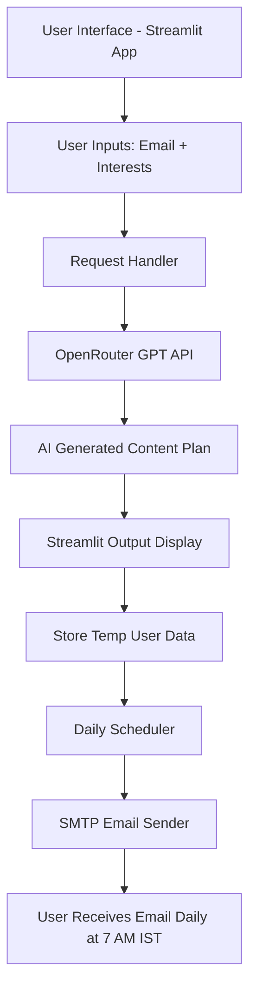

# Architecture Diagram – Social Media Agent

---

### Explanation

* **Streamlit UI** collects user inputs
* **AI Model (GPT)** generates tailored content
* **Scheduler** automates daily email
* **SMTP** sends the email to the user
* No database is used; data is runtime-only
